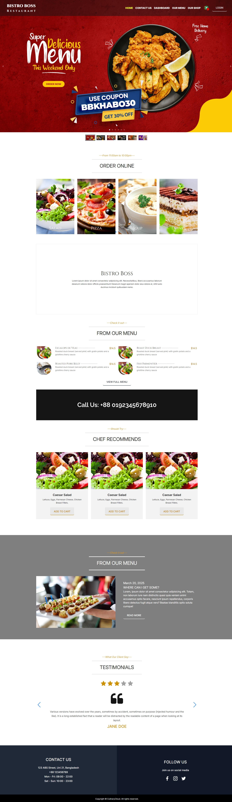

## Bistro🍳Boss

Bistro Boss is a comprehensive restaurant management website built using the MERN stack (MongoDB, Express.js, React with Vite, and Node.js). This application aims to streamline restaurant operations, providing an intuitive interface for managing reservations, orders, menus, and staff.

## Features

- **User Authentication**: Secure login and registration using JWT.
- **Reservation Management**: View, create, and manage customer reservations.
- **Order
- <b>Menu Management</b>: Add, update, and remove menu items.
- <b>Staff Management</b>: Manage staff roles and schedules.
- <b>Dashboard:</b> Overview of key metrics and restaurant performance.

## Landing Page Structure
<!--  -->
